# System Architecture

## Overview
This diagram shows the complete system architecture of MailGuard, including frontend components, backend services, external integrations, and deployment infrastructure.

## System Architecture Diagram

```mermaid
graph TD
    %% User Layer
    subgraph "User Interface Layer"
        WebApp[🌐 React Web Application]
        MobileView[📱 Mobile Responsive UI]
        AdminPanel[⚙️ Admin Dashboard]
    end
    
    %% API Gateway
    APIGateway[🚪 API Gateway / Load Balancer]
    
    %% Application Layer
    subgraph "Application Services"
        AuthService[🔐 Authentication Service]
        EmailService[📧 Email Processing Service]
        MLService[🤖 ML Analysis Service]
        NotificationService[🔔 Notification Service]
        AdminService[👨‍💼 Admin Management Service]
    end
    
    %% Edge Functions
    subgraph "Supabase Edge Functions"
        EmailClassifier[🏷️ Email Classifier]
        SecurityAdvisor[🛡️ Security Advisor]
        OutlookAuth[🔑 Outlook Authentication]
        FetchEmails[📥 Fetch Outlook Emails]
        ChatAssistant[💬 Chat Assistant]
        SendAlerts[🚨 Send Alert Emails]
        FeedbackProcessor[💭 Feedback Processor]
        DataExporter[📤 Data Export Service]
    end
    
    %% Database Layer
    subgraph "Data Layer"
        PostgresDB[(🗄️ PostgreSQL Database)]
        AuthDB[(👤 Supabase Auth)]
        StorageBucket[(📁 File Storage)]
    end
    
    %% External Services
    subgraph "External Integrations"
        OutlookAPI[📧 Microsoft Graph API]
        EmailProvider[✉️ Resend Email Service]
        MLModels[🧠 ML Model Storage]
        CDN[🌍 Content Delivery Network]
    end
    
    %% Infrastructure
    subgraph "Infrastructure & Deployment"
        Vercel[🚀 Vercel Hosting]
        Supabase[⚡ Supabase Backend]
        GitHub[📂 GitHub Repository]
        MonitoringService[📊 Monitoring & Analytics]
    end
    
    %% Connections - User to API
    WebApp --> APIGateway
    MobileView --> APIGateway
    AdminPanel --> APIGateway
    
    %% API Gateway to Services
    APIGateway --> AuthService
    APIGateway --> EmailService
    APIGateway --> MLService
    APIGateway --> NotificationService
    APIGateway --> AdminService
    
    %% Services to Edge Functions
    AuthService --> OutlookAuth
    EmailService --> FetchEmails
    EmailService --> EmailClassifier
    MLService --> SecurityAdvisor
    NotificationService --> SendAlerts
    AdminService --> DataExporter
    
    %% Edge Functions to Database
    EmailClassifier --> PostgresDB
    SecurityAdvisor --> PostgresDB
    OutlookAuth --> AuthDB
    FetchEmails --> PostgresDB
    ChatAssistant --> PostgresDB
    SendAlerts --> PostgresDB
    FeedbackProcessor --> PostgresDB
    DataExporter --> PostgresDB
    
    %% External Service Connections
    OutlookAuth --> OutlookAPI
    FetchEmails --> OutlookAPI
    SendAlerts --> EmailProvider
    SecurityAdvisor --> MLModels
    
    %% Infrastructure Connections
    WebApp -.-> Vercel
    EdgeFunctions -.-> Supabase
    PostgresDB -.-> Supabase
    AuthDB -.-> Supabase
    StorageBucket -.-> Supabase
    
    %% Development & Deployment
    GitHub -.-> Vercel
    GitHub -.-> Supabase
    MonitoringService -.-> Vercel
    MonitoringService -.-> Supabase
    
    %% CDN for Static Assets
    CDN --> WebApp
    
    %% Styling
    classDef frontend fill:#e3f2fd,stroke:#1976d2,stroke-width:2px
    classDef backend fill:#f3e5f5,stroke:#7b1fa2,stroke-width:2px
    classDef database fill:#e8f5e8,stroke:#388e3c,stroke-width:2px
    classDef external fill:#fff3e0,stroke:#f57c00,stroke-width:2px
    classDef infrastructure fill:#fce4ec,stroke:#c2185b,stroke-width:2px
    
    class WebApp,MobileView,AdminPanel frontend
    class AuthService,EmailService,MLService,NotificationService,AdminService,EmailClassifier,SecurityAdvisor,OutlookAuth,FetchEmails,ChatAssistant,SendAlerts,FeedbackProcessor,DataExporter backend
    class PostgresDB,AuthDB,StorageBucket database
    class OutlookAPI,EmailProvider,MLModels,CDN external
    class Vercel,Supabase,GitHub,MonitoringService,APIGateway infrastructure
```

## Architecture Components

### Frontend Layer

#### React Web Application
- **Technology**: React 18, TypeScript, Vite
- **Styling**: Tailwind CSS with custom design system
- **State Management**: React Query for server state
- **Routing**: React Router DOM
- **Features**: Real-time updates, responsive design, PWA capabilities

#### Mobile Responsive UI
- **Approach**: Mobile-first responsive design
- **Breakpoints**: Tailored for phones, tablets, desktop
- **Touch Optimization**: Gesture-friendly interactions
- **Performance**: Optimized bundle size and loading

#### Admin Dashboard
- **Purpose**: System administration and monitoring
- **Features**: User management, analytics, system configuration
- **Security**: Role-based access control
- **Real-time**: Live system metrics and alerts

### Application Services Layer

#### Authentication Service
- **Provider**: Supabase Auth
- **Features**: Email/password, OAuth, MFA
- **Session Management**: JWT tokens with refresh
- **Security**: Row-level security, audit logging

#### Email Processing Service
- **Functions**: Email ingestion, preprocessing, storage
- **Integration**: Microsoft Graph API
- **Processing**: Asynchronous batch and real-time
- **Storage**: Structured data in PostgreSQL

#### ML Analysis Service
- **Purpose**: Email classification and threat detection
- **Models**: Spam, phishing, malware detection
- **Performance**: <500ms analysis time
- **Accuracy**: >95% classification accuracy

#### Notification Service
- **Channels**: Email alerts, in-app notifications
- **Provider**: Resend for email delivery
- **Templates**: Dynamic content generation
- **Delivery**: Reliable with retry mechanisms

### Edge Functions Layer

#### Email Classifier
- **Runtime**: Deno with TypeScript
- **Function**: ML-powered email classification
- **Input**: Raw email data
- **Output**: Security classification with confidence

#### Security Advisor
- **Purpose**: Generate security recommendations
- **Analysis**: Risk assessment and advice generation
- **Integration**: Feeds into alert system
- **Knowledge Base**: Updated security intelligence

#### Outlook Authentication
- **Protocol**: OAuth 2.0 with PKCE
- **Scopes**: Mail.Read, User.Read
- **Token Management**: Secure storage and refresh
- **Error Handling**: Comprehensive error recovery

### Data Layer

#### PostgreSQL Database
- **Tables**: Users, emails, feedback, audit logs
- **Security**: Row-level security policies
- **Performance**: Optimized indexes and queries
- **Backup**: Automated daily backups

#### Supabase Auth
- **Users**: Authentication and user management
- **Policies**: Fine-grained access control
- **Integration**: Seamless with application layer
- **Compliance**: GDPR and security standards

#### File Storage
- **Purpose**: Attachments and static assets
- **Security**: Access control and encryption
- **CDN**: Global content delivery
- **Optimization**: Automatic image optimization

### External Integrations

#### Microsoft Graph API
- **Purpose**: Outlook email access
- **Authentication**: OAuth 2.0
- **Rate Limits**: Respectful API usage
- **Permissions**: Minimal required scopes

#### Resend Email Service
- **Purpose**: Outbound alert emails
- **Features**: Templates, analytics, deliverability
- **Integration**: API-based with error handling
- **Compliance**: CAN-SPAM and GDPR compliant

#### ML Model Storage
- **Location**: Cloud storage with CDN
- **Versioning**: Model version management
- **Security**: Encrypted storage and access
- **Updates**: Automated model deployment

### Infrastructure & Deployment

#### Vercel Hosting
- **Frontend**: Static site generation and hosting
- **Performance**: Global edge network
- **CI/CD**: GitHub integration with auto-deployment
- **Analytics**: Performance and usage metrics

#### Supabase Backend
- **Database**: Managed PostgreSQL
- **Edge Functions**: Serverless function execution
- **Real-time**: WebSocket connections
- **Monitoring**: Built-in observability

#### GitHub Repository
- **Version Control**: Git with branching strategy
- **CI/CD**: Automated testing and deployment
- **Security**: Dependabot and security scanning
- **Documentation**: Comprehensive project docs

## Security Architecture

### Authentication & Authorization
- Multi-factor authentication support
- Role-based access control (RBAC)
- Session management with secure tokens
- API key management for external services

### Data Protection
- Encryption at rest and in transit
- Row-level security policies
- Data minimization principles
- GDPR compliance features

### Network Security
- HTTPS/TLS encryption
- CORS policies for API access
- Rate limiting and DDoS protection
- Security headers implementation

### Monitoring & Audit
- Comprehensive audit logging
- Real-time security monitoring
- Performance metrics tracking
- Error tracking and alerting

## Scalability Features

### Horizontal Scaling
- Serverless edge functions auto-scale
- Database connection pooling
- CDN for global content delivery
- Load balancing for high availability

### Performance Optimization
- Code splitting and lazy loading
- Database query optimization
- Caching strategies at multiple layers
- Asset optimization and compression

### Reliability
- Error boundary implementation
- Graceful degradation strategies
- Health checks and monitoring
- Automated backup and recovery

## Development Workflow

### Local Development
- Hot reload development server
- Local Supabase instance
- Environment variable management
- Testing with Jest and React Testing Library

### Deployment Pipeline
- GitHub Actions for CI/CD
- Automated testing on pull requests
- Staging environment for testing
- Production deployment with rollback capability

### Monitoring & Maintenance
- Application performance monitoring
- Error tracking and alerting
- User analytics and feedback
- Regular security updates