# Data Flow Diagram (DFD)

## Overview
This DFD illustrates how data flows through the MailGuard system, from email ingestion through ML analysis to user notifications and administrative oversight.

## System Data Flow

```mermaid
flowchart TD
    %% External Entities
    User[👤 User]
    Admin[👨‍💼 Admin]
    Outlook[📧 Microsoft Outlook]
    
    %% Main Processes
    Auth[🔐 Authentication System]
    EmailFetch[📥 Email Fetcher]
    MLAnalysis[🤖 ML Email Analyzer]
    SecurityAdvisor[🛡️ Security Advisor]
    AlertSystem[🚨 Alert System]
    FeedbackProcessor[💬 Feedback Processor]
    AdminPanel[⚙️ Admin Panel]
    
    %% Data Stores
    UserDB[(👥 User Profiles)]
    EmailDB[(📧 Email Data)]
    FeedbackDB[(💭 Feedback Data)]
    AuditDB[(📋 Audit Logs)]
    MFADB[(🔑 MFA Secrets)]
    
    %% User Authentication Flow
    User -->|Login Credentials| Auth
    Auth -->|User Data| UserDB
    Auth -->|MFA Challenge| MFADB
    Auth -->|Session Token| User
    
    %% Email Processing Flow
    User -->|Authorize Access| Outlook
    Outlook -->|OAuth Token| EmailFetch
    EmailFetch -->|Raw Email Data| MLAnalysis
    MLAnalysis -->|Classification Results| EmailDB
    MLAnalysis -->|Security Analysis| SecurityAdvisor
    
    %% Security Alert Flow
    SecurityAdvisor -->|Threat Detection| AlertSystem
    AlertSystem -->|Alert Data| EmailDB
    AlertSystem -->|Security Email| User
    
    %% Feedback Flow
    User -->|Feedback Input| FeedbackProcessor
    FeedbackProcessor -->|Feedback Data| FeedbackDB
    FeedbackProcessor -->|ML Training Data| MLAnalysis
    
    %% Admin Management Flow
    Admin -->|Admin Actions| AdminPanel
    AdminPanel -->|User Management| UserDB
    AdminPanel -->|Email Review| EmailDB
    AdminPanel -->|System Logs| AuditDB
    AdminPanel -->|Analytics Query| EmailDB
    
    %% Audit and Monitoring
    Auth -->|Login Events| AuditDB
    EmailFetch -->|Access Events| AuditDB
    AdminPanel -->|Admin Actions| AuditDB
    
    %% Data Relationships
    UserDB -.->|User Context| EmailDB
    EmailDB -.->|Email Reference| FeedbackDB
    UserDB -.->|User Reference| AuditDB
    
    %% Styling
    classDef process fill:#e1f5fe,stroke:#01579b,stroke-width:2px
    classDef datastore fill:#f3e5f5,stroke:#4a148c,stroke-width:2px
    classDef external fill:#e8f5e8,stroke:#1b5e20,stroke-width:2px
    
    class Auth,EmailFetch,MLAnalysis,SecurityAdvisor,AlertSystem,FeedbackProcessor,AdminPanel process
    class UserDB,EmailDB,FeedbackDB,AuditDB,MFADB datastore
    class User,Admin,Outlook external
```

## Process Descriptions

### 1. Authentication System
- **Input**: User credentials, MFA tokens
- **Process**: Validates login, manages sessions, handles MFA
- **Output**: Session tokens, user context
- **Data Stores**: User Profiles, MFA Secrets, Audit Logs

### 2. Email Fetcher
- **Input**: OAuth tokens from Outlook
- **Process**: Retrieves emails via Microsoft Graph API
- **Output**: Raw email data for analysis
- **Data Stores**: Email Data, Audit Logs

### 3. ML Email Analyzer
- **Input**: Raw email content, user feedback
- **Process**: Classifies emails, detects threats, learns from feedback
- **Output**: Security classifications, confidence scores
- **Data Stores**: Email Data, Feedback Data

### 4. Security Advisor
- **Input**: ML analysis results
- **Process**: Generates security recommendations and advice
- **Output**: Security guidance, threat assessments
- **Data Stores**: Email Data

### 5. Alert System
- **Input**: Threat detections from Security Advisor
- **Process**: Generates and sends security alert emails
- **Output**: Alert notifications to users
- **Data Stores**: Email Data, User Profiles

### 6. Feedback Processor
- **Input**: User feedback on email classifications
- **Process**: Stores feedback, improves ML models
- **Output**: Training data for ML system
- **Data Stores**: Feedback Data, Email Data

### 7. Admin Panel
- **Input**: Admin commands and queries
- **Process**: User management, system monitoring, analytics
- **Output**: Administrative reports and controls
- **Data Stores**: All data stores for comprehensive management

## Data Flow Characteristics

### Security Features
- All data flows are encrypted in transit
- User data is isolated through RLS policies
- Audit trails track all data access and modifications
- MFA protects sensitive operations

### Performance Considerations
- Asynchronous email processing prevents UI blocking
- Batch processing for ML analysis efficiency
- Caching for frequently accessed user data
- Optimized queries for admin analytics

### Integration Points
- Microsoft Graph API for email access
- Supabase Edge Functions for serverless processing
- Real-time notifications through WebSocket connections
- RESTful APIs for frontend-backend communication