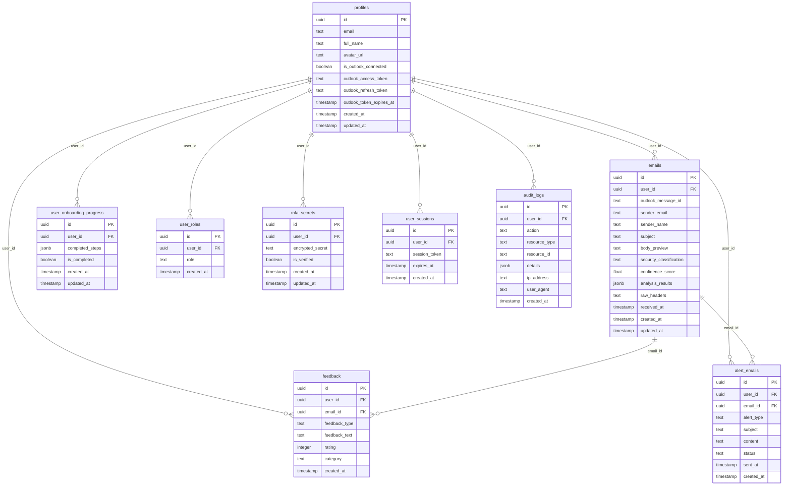

# Entity Relationship Diagram (ERD)

## Overview
This ERD shows the complete database schema for MailGuard, including all tables, relationships, and key constraints that support user management, email analysis, security features, and administrative functions.

## Database Schema

## Table Descriptions

### Core User Management
- **profiles**: Extended user information beyond Supabase auth
- **user_roles**: Role-based access control (admin/user)
- **user_sessions**: Session management for extended functionality
- **mfa_secrets**: Multi-factor authentication secrets storage

### Email Processing
- **emails**: Processed email data with ML analysis results
- **alert_emails**: Security alert notifications sent to users

### User Experience
- **feedback**: User feedback on email classifications and system
- **user_onboarding_progress**: Tracks user onboarding completion
- **audit_logs**: Security and action logging for compliance

## Key Relationships

1. **User-Email**: One user can have many emails analyzed
2. **Email-Feedback**: Each email can receive user feedback
3. **User-Alerts**: Users receive security alert emails
4. **User-Audit**: All user actions are logged for security
5. **User-MFA**: Each user can have MFA enabled with secret storage

## Security Features

- Row Level Security (RLS) enabled on all tables
- User isolation through user_id foreign keys
- Encrypted storage for sensitive data (MFA secrets)
- Comprehensive audit logging
- Token-based session management