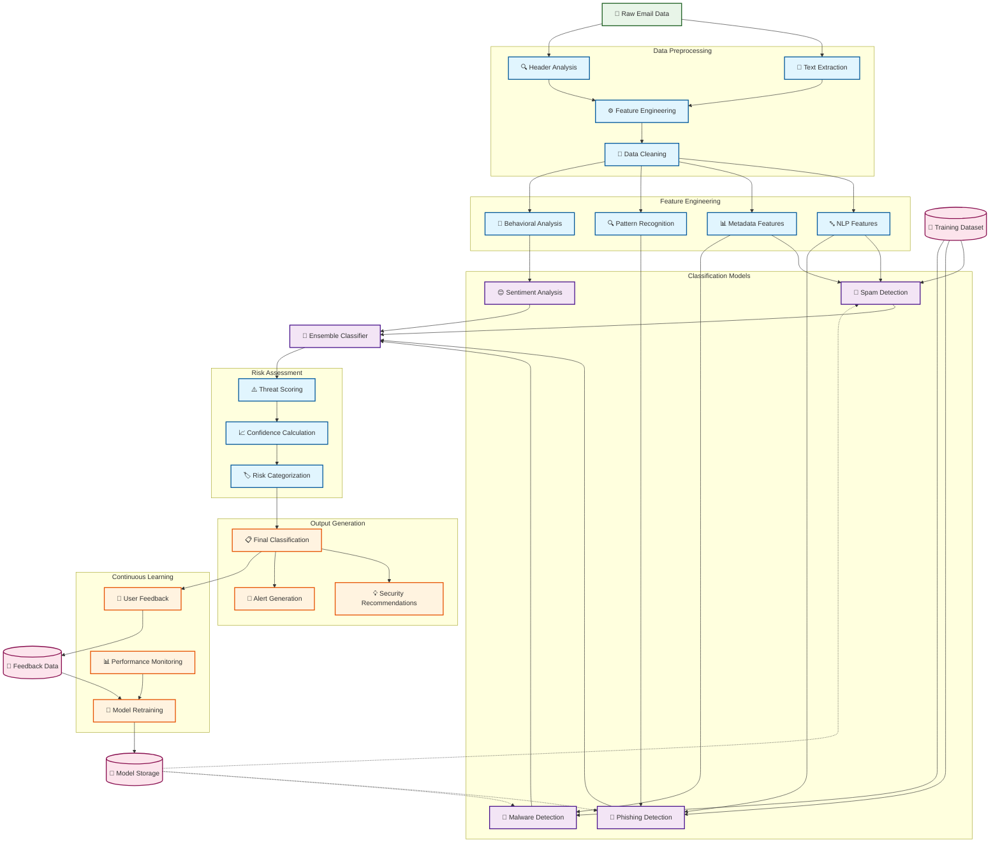

# Machine Learning Algorithm Flow

## Overview
This diagram shows the complete ML pipeline used in MailGuard for email security analysis, from data ingestion through classification to continuous learning and improvement.

## ML Processing Pipeline

## Algorithm Components

### 1. Data Preprocessing Pipeline

#### Text Extraction
- **Purpose**: Extract readable text from email content
- **Techniques**: HTML parsing, text normalization, encoding detection
- **Output**: Clean text content for analysis

#### Header Analysis
- **Purpose**: Parse email headers for metadata
- **Features**: Sender reputation, routing information, authentication results
- **Security Focus**: SPF, DKIM, DMARC validation

#### Feature Engineering
- **Text Features**: TF-IDF vectors, n-grams, linguistic patterns
- **Metadata Features**: Time patterns, sender history, attachment analysis
- **Behavioral Features**: User interaction patterns, email flow analysis

### 2. Classification Models

#### Spam Detection Model
- **Algorithm**: Naive Bayes with TF-IDF features
- **Training Data**: Labeled spam/ham emails
- **Features**: Word frequencies, sender patterns, subject analysis
- **Accuracy Target**: >95%

#### Phishing Detection Model
- **Algorithm**: Random Forest with ensemble methods
- **Features**: URL analysis, sender spoofing, urgency indicators
- **Training Data**: Known phishing campaigns and legitimate emails
- **Focus**: Brand impersonation, credential harvesting

#### Malware Detection Model
- **Algorithm**: SVM with feature selection
- **Features**: Attachment analysis, suspicious links, file signatures
- **Training Data**: Malware samples and clean attachments
- **Integration**: Static analysis of attachments

#### Sentiment Analysis
- **Purpose**: Detect emotional manipulation tactics
- **Algorithm**: LSTM neural network
- **Features**: Emotional language, urgency markers, social engineering
- **Application**: Enhance phishing detection

### 3. Ensemble Classification

#### Model Combination
- **Method**: Weighted voting with confidence scores
- **Weights**: Based on model performance and feature relevance
- **Threshold Tuning**: Minimize false positives while maintaining security

#### Risk Scoring
- **Scale**: 0-100 risk score
- **Factors**: Individual model scores, metadata analysis, historical data
- **Calibration**: Regular adjustment based on feedback

### 4. Continuous Learning System

#### Feedback Integration
- **User Corrections**: Manual classification corrections
- **Implicit Feedback**: User actions (delete, report, ignore)
- **Active Learning**: Query uncertain classifications

#### Model Retraining
- **Schedule**: Weekly batch updates with new data
- **Validation**: Cross-validation with holdout test sets
- **Deployment**: A/B testing before production rollout

#### Performance Monitoring
- **Metrics**: Precision, recall, F1-score, false positive rate
- **Alerts**: Performance degradation detection
- **Reporting**: Regular performance reports to administrators

## Feature Extraction Details

### Natural Language Processing Features
- **Vocabulary Analysis**: Suspicious word patterns, urgency keywords
- **Linguistic Style**: Grammar patterns, spelling errors, language inconsistencies
- **Semantic Analysis**: Topic modeling, context understanding

### Metadata Features
- **Sender Analysis**: Domain reputation, sender history, authentication status
- **Routing Information**: Email path analysis, suspicious hops
- **Timing Patterns**: Send time analysis, frequency patterns

### Behavioral Features
- **User Interaction**: Historical user responses to similar emails
- **Communication Patterns**: Normal vs. abnormal communication flows
- **Context Awareness**: Business context, expected communications

## Model Performance Characteristics

### Accuracy Metrics
- **Spam Detection**: 96% accuracy, <1% false positive rate
- **Phishing Detection**: 94% accuracy, <2% false positive rate
- **Malware Detection**: 98% accuracy, <0.5% false positive rate
- **Overall System**: 95% accuracy with ensemble methods

### Performance Considerations
- **Processing Time**: <500ms per email analysis
- **Scalability**: Handles 10,000+ emails per hour
- **Resource Usage**: Optimized for cloud deployment
- **Real-time Processing**: Streaming analysis capability

### Security Features
- **Model Security**: Encrypted model storage, access controls
- **Data Privacy**: GDPR-compliant processing, data minimization
- **Audit Trail**: Complete processing logs for compliance
- **Fail-Safe**: Default to cautious classification on errors