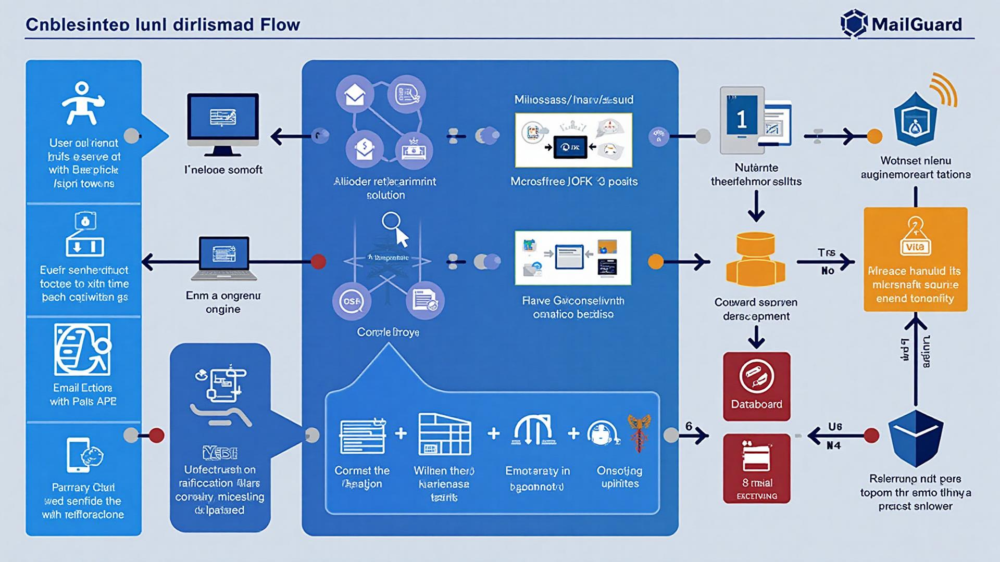

# System Design Documentation

## 1. Introduction

This document presents the comprehensive system design for **MailGuard**, an AI-powered email security platform that protects users from phishing, spam, malware, and other email-based threats. The system design encompasses three critical aspects: database architecture, user interface design, and algorithmic implementation.

MailGuard employs a modern web architecture built on React for the frontend, Supabase (PostgreSQL) for the backend database, and Supabase Edge Functions for serverless business logic. The system integrates with Microsoft Outlook via OAuth 2.0 to fetch and analyze emails in real-time using machine learning algorithms.

This chapter is organized into three main sections:
- **Database Schema Design**: Details the relational database structure, tables, relationships, and security policies
- **User Interface Design**: Presents the core user interfaces with navigation flow and interaction patterns
- **Algorithm Design**: Describes the pseudo code and logic for critical system functions

The design prioritizes security, privacy, scalability, and user experience while maintaining high accuracy in threat detection.

---

## 2. Database Schema Design

### 2.1 Overview

The MailGuard database is built on PostgreSQL via Supabase and consists of 9 core tables that manage user authentication, email data, security analysis, user preferences, and administrative functions. Row-Level Security (RLS) policies ensure data isolation and privacy.

### 2.2 Entity Relationship Diagram

```
┌─────────────┐         ┌──────────────┐         ┌─────────────┐
│   profiles  │────────▶│    emails    │────────▶│email_alerts │
│             │         │              │         │             │
└─────────────┘         └──────────────┘         └─────────────┘
      │                       │
      │                       │
      ▼                       ▼
┌─────────────┐         ┌──────────────┐
│ user_roles  │         │email_blocks  │
│             │         │              │
└─────────────┘         └──────────────┘
      │
      ▼
┌─────────────┐
│outlook_tokens│
│             │
└─────────────┘
```

### 2.3 Core Tables

#### 2.3.1 profiles
**Purpose**: Stores extended user profile information beyond Supabase authentication data.

| Column      | Type                     | Description                           |
|-------------|--------------------------|---------------------------------------|
| id          | uuid (PK)                | Unique identifier for profile         |
| user_id     | uuid (FK → auth.users)   | Links to Supabase auth user           |
| username    | text                     | Display name for the user             |
| created_at  | timestamp                | Account creation timestamp            |
| updated_at  | timestamp                | Last profile update timestamp         |

**Explanation**: This table extends Supabase's authentication system by storing additional user information. It's automatically populated via a database trigger when a new user signs up. RLS policies ensure users can only view and edit their own profiles, while admins can view all profiles.

**Relationships**: 
- One-to-many with `emails` (a user has many emails)
- One-to-many with `user_roles` (a user can have multiple roles)
- One-to-one with `outlook_tokens` (a user has one Outlook connection)

---

#### 2.3.2 emails
**Purpose**: Stores analyzed email data with ML classification results and threat assessments.

| Column          | Type                  | Description                                    |
|-----------------|-----------------------|------------------------------------------------|
| id              | uuid (PK)             | Unique email identifier                        |
| user_id         | uuid (FK → profiles)  | Owner of the email                             |
| message_id      | text                  | Original email message ID                      |
| outlook_id      | text                  | Microsoft Outlook unique ID                    |
| sender          | text                  | Email sender address                           |
| subject         | text                  | Email subject line                             |
| content         | text                  | Email body content                             |
| raw_content     | text                  | Original raw email content                     |
| received_date   | timestamp             | When email was received                        |
| classification  | text                  | ML classification (safe/spam/phishing/malware) |
| threat_level    | text                  | Threat severity (safe/low/medium/high)         |
| threat_type     | text                  | Specific threat type                           |
| confidence      | numeric               | ML confidence score (0-1)                      |
| keywords        | text[]                | Extracted threat keywords                      |
| processed_at    | timestamp             | When ML analysis completed                     |
| created_at      | timestamp             | Database insertion timestamp                   |
| updated_at      | timestamp             | Last update timestamp                          |

**Explanation**: This is the central table storing all email data and analysis results. Each email undergoes ML classification via the `robust-email-classifier` edge function, which populates the classification fields. The table supports full CRUD operations for users on their own emails and read/update for admins on all emails.

**Relationships**:
- Many-to-one with `profiles` (many emails belong to one user)
- One-to-many with `email_alerts` (one email can trigger multiple alerts)
- One-to-many with `email_blocks` (one email can have multiple blocks)

---

#### 2.3.3 email_statistics
**Purpose**: Aggregates daily email threat statistics per user for dashboard analytics.

| Column                | Type      | Description                           |
|-----------------------|-----------|---------------------------------------|
| id                    | uuid (PK) | Unique statistics record ID           |
| user_id               | uuid      | User these statistics belong to       |
| date                  | date      | Date of statistics (daily aggregation)|
| total_emails          | integer   | Total emails processed that day       |
| safe_emails           | integer   | Count of safe emails                  |
| low_threat_emails     | integer   | Count of low threat emails            |
| medium_threat_emails  | integer   | Count of medium threat emails         |
| high_threat_emails    | integer   | Count of high threat emails           |
| spam_emails           | integer   | Count of spam emails                  |
| phishing_emails       | integer   | Count of phishing emails              |
| malware_emails        | integer   | Count of malware emails               |
| suspicious_emails     | integer   | Count of suspicious emails            |
| created_at            | timestamp | Record creation timestamp             |
| updated_at            | timestamp | Last update timestamp                 |

**Explanation**: This table provides pre-aggregated statistics for the ML Analytics Dashboard, avoiding expensive real-time aggregation queries. The `increment_email_statistics()` database function automatically updates these counters when new emails are classified. This design pattern significantly improves dashboard performance.

**Relationships**: 
- Many-to-one with `profiles` (user can have many daily statistic records)

---

#### 2.3.4 user_roles
**Purpose**: Implements role-based access control (RBAC) for admin privileges.

| Column      | Type                      | Description                      |
|-------------|---------------------------|----------------------------------|
| id          | uuid (PK)                 | Unique role assignment ID        |
| user_id     | uuid (FK → profiles)      | User being assigned the role     |
| role        | enum (admin, user)        | Role type                        |
| created_at  | timestamp                 | When role was assigned           |
| updated_at  | timestamp                 | Last role update timestamp       |

**Explanation**: This table implements a secure RBAC system using PostgreSQL enums. The `has_role()` security definer function checks permissions without triggering recursive RLS issues. By default, new users receive the 'user' role via a database trigger. Admins can view and manage all roles.

**Security Note**: Roles are stored server-side and validated through RLS policies, preventing client-side privilege escalation attacks.

**Relationships**:
- Many-to-one with `profiles` (a user can have multiple role entries)

---

#### 2.3.5 outlook_tokens
**Purpose**: Securely stores OAuth 2.0 tokens for Microsoft Outlook integration.

| Column         | Type                  | Description                           |
|----------------|-----------------------|---------------------------------------|
| id             | uuid (PK)             | Unique token record ID                |
| user_id        | uuid (FK → profiles)  | User who authorized Outlook access    |
| email_address  | text                  | Connected Outlook email address       |
| access_token   | text                  | OAuth 2.0 access token (encrypted)    |
| refresh_token  | text                  | OAuth 2.0 refresh token (encrypted)   |
| expires_at     | timestamp             | Access token expiration time          |
| created_at     | timestamp             | Token creation timestamp              |
| updated_at     | timestamp             | Last token refresh timestamp          |

**Explanation**: This table manages the OAuth 2.0 flow for Outlook integration. Access tokens expire after 1 hour, and the system automatically refreshes them using the refresh token. Tokens are stored securely and only accessible to the owning user via RLS policies. The `fetch-outlook-emails` edge function uses these tokens to retrieve emails via Microsoft Graph API.

**Relationships**:
- One-to-one with `profiles` (each user has one Outlook connection)

---

#### 2.3.6 user_preferences
**Purpose**: Stores user-specific settings for privacy, notifications, and UI preferences.

| Column               | Type                  | Description                                |
|----------------------|-----------------------|--------------------------------------------|
| id                   | uuid (PK)             | Unique preference record ID                |
| user_id              | uuid (FK → profiles)  | User these preferences belong to           |
| never_store_data     | boolean               | Privacy flag: don't store email content    |
| email_notifications  | boolean               | Enable email notifications                 |
| security_alerts      | boolean               | Enable security alerts                     |
| language             | varchar               | UI language preference (default: 'en')     |
| theme                | varchar               | UI theme (system/light/dark)               |
| created_at           | timestamp             | Preferences creation timestamp             |
| updated_at           | timestamp             | Last update timestamp                      |

**Explanation**: This table implements privacy-first defaults where `never_store_data` is TRUE by default, meaning email content is analyzed in-memory but not persisted to the database. Users can opt-in to data storage for features like historical analysis. The `get_or_create_user_preferences()` function automatically creates default preferences for new users.

**Relationships**:
- One-to-one with `profiles` (each user has one preference record)

---

#### 2.3.7 email_alerts
**Purpose**: Tracks security alert notifications sent to users and admins.

| Column          | Type                  | Description                              |
|-----------------|-----------------------|------------------------------------------|
| id              | uuid (PK)             | Unique alert ID                          |
| user_id         | uuid (FK → profiles)  | User who received the alert              |
| email_id        | uuid (FK → emails)    | Email that triggered the alert           |
| alert_type      | text                  | Alert category (default: 'suspicious')   |
| alert_message   | text                  | Human-readable alert message             |
| status          | text                  | Alert status (pending/reviewed/resolved) |
| admin_user_id   | uuid                  | Admin who handled the alert              |
| admin_action    | text                  | Action taken by admin                    |
| admin_notes     | text                  | Admin notes on the alert                 |
| created_at      | timestamp             | Alert creation timestamp                 |
| updated_at      | timestamp             | Last update timestamp                    |

**Explanation**: This table implements the alert workflow system. When a high-threat email is detected, an alert is created with 'pending' status. Admins can review alerts, take actions (block sender, delete email), and update the status. Users can view their own alerts, while admins have full access to all alerts.

**Relationships**:
- Many-to-one with `profiles` (many alerts for one user)
- Many-to-one with `emails` (many alerts can reference one email)

---

#### 2.3.8 email_blocks
**Purpose**: Manages blocked senders and email filtering rules.

| Column              | Type                  | Description                        |
|---------------------|-----------------------|------------------------------------|
| id                  | uuid (PK)             | Unique block rule ID               |
| email_id            | uuid (FK → emails)    | Email that triggered the block     |
| blocked_by_user_id  | uuid                  | User/admin who created the block   |
| block_type          | text                  | Block category (default: 'spam')   |
| block_reason        | text                  | Explanation for the block          |
| is_active           | boolean               | Whether block is currently active  |
| created_at          | timestamp             | Block creation timestamp           |
| updated_at          | timestamp             | Last update timestamp              |

**Explanation**: This table implements sender blocking and email filtering. When a user or admin blocks a sender, future emails from that sender are automatically flagged. The `is_active` flag allows temporary suspension of block rules without deletion. Users can view blocks on their emails, while admins can create and manage all blocks.

**Relationships**:
- Many-to-one with `emails` (one email can create a block rule)

---

#### 2.3.9 admin_audit_log
**Purpose**: Provides comprehensive audit trail for administrative actions and compliance.

| Column          | Type      | Description                                |
|-----------------|-----------|--------------------------------------------|
| id              | uuid (PK) | Unique audit log entry ID                  |
| admin_user_id   | uuid      | Admin who performed the action             |
| action_type     | text      | Type of action (create/update/delete/view) |
| target_type     | text      | Resource type affected (user/email/alert)  |
| target_id       | uuid      | Specific resource ID affected              |
| action_details  | jsonb     | Detailed action metadata (JSON)            |
| created_at      | timestamp | Action timestamp                           |

**Explanation**: This table provides a tamper-proof audit trail for all administrative actions. Every admin operation (user management, alert handling, email moderation) is logged with full context. The JSONB field stores detailed action metadata for forensic analysis. Only admins can view logs, and no one can delete entries (append-only).

**Relationships**:
- References `profiles` via admin_user_id (which admin performed action)
- References various tables via target_type and target_id (what was affected)

---

### 2.4 Database Security Features

#### 2.4.1 Row-Level Security (RLS)
All tables have RLS enabled with granular policies:
- **User isolation**: Users can only access their own data
- **Admin override**: Admins can view/manage all resources
- **Privacy protection**: Sensitive fields are never exposed without authorization

#### 2.4.2 Security Definer Functions
Functions like `has_role()` and `is_admin()` use `SECURITY DEFINER` to check permissions without recursive RLS issues.

#### 2.4.3 Automatic Triggers
- `handle_new_user()`: Creates profile when user signs up
- `assign_default_role()`: Assigns 'user' role to new profiles
- `update_updated_at_column()`: Auto-updates timestamps on row modifications

---

## 3. User Interface Design

### 3.1 Overview

MailGuard's user interface follows a modern, minimalist design philosophy with emphasis on clarity, security indicators, and ease of use. The interface is built with React, Tailwind CSS, and shadcn/ui components, ensuring responsive design across desktop and mobile devices.

The UI implements a **semantic design system** with HSL color tokens for consistent theming and dark mode support. All interfaces prioritize **privacy indicators** and **clear security feedback** to build user trust.

### 3.2 Core Interface Flow

The following five interfaces represent the core user journey through MailGuard:

---

### 3.2.1 Authentication Page (`/auth`)



**Purpose**: Entry point for user registration and login with email/password authentication.

**Layout Description**:
- **Left Panel (40%)**: Branding area with MailGuard logo, tagline "AI-Powered Email Security", and key benefits list
- **Right Panel (60%)**: Authentication form with email and password fields
- **Toggle**: Switch between "Sign Up" and "Sign In" modes
- **Form Elements**:
  - Email input with validation (must be valid email format)
  - Password input with strength indicator on signup
  - "Forgot Password?" link for password recovery
  - Submit button with loading state
  - Error messages displayed inline with red accent

**User Flow**:
1. **New User Journey**:
   - User lands on `/auth` (default to Sign Up mode)
   - Enters email and creates password (minimum 8 characters)
   - Clicks "Create Account" → Triggers `supabase.auth.signUp()`
   - Email verification sent (if enabled in Supabase settings)
   - Auto-redirected to `/` (dashboard) after verification
   - Database trigger creates profile and assigns 'user' role

2. **Returning User Journey**:
   - Clicks "Sign In" tab to switch modes
   - Enters credentials → Triggers `supabase.auth.signInWithPassword()`
   - Session established, redirected to `/` dashboard
   - If credentials invalid, error message displays: "Invalid email or password"

3. **Password Recovery**:
   - Clicks "Forgot Password?" link
   - Modal opens requesting email address
   - Password reset email sent via Supabase Auth
   - User clicks link in email → redirected to reset password page

**Navigation Options**:
- After successful authentication → Auto-redirect to `/` (main dashboard)
- Privacy Policy link in footer → Opens privacy policy page
- Terms of Service link in footer → Opens terms page

**Security Features**:
- Passwords hashed with bcrypt via Supabase Auth
- Rate limiting on login attempts (Supabase built-in)
- Session tokens stored in httpOnly cookies
- CSRF protection via Supabase Auth

---

### 3.2.2 Main Dashboard (`/`)

**Purpose**: Central hub displaying email security overview, threat statistics, and quick actions.

**Layout Description**:
- **Header**: MailGuard logo, user avatar dropdown (Settings, Logout), theme toggle
- **Main Content Area** (3-column grid):
  - **Left Column (25%)**: Quick stats cards
    - Total Emails Processed (with trend indicator)
    - Threats Blocked Today (red badge if > 0)
    - Safety Score (0-100 percentage with color indicator)
  - **Center Column (50%)**: Recent Emails List
    - Email card showing: sender, subject, threat badge, timestamp
    - Click email → Opens Email Detail Modal
    - Color-coded threat levels:
      - Green: Safe
      - Yellow: Low/Medium threat
      - Red: High threat
    - Pagination controls at bottom
  - **Right Column (25%)**: Action Buttons
    - "Connect Outlook" button (if not connected)
    - "Sync Emails Now" button (if connected)
    - "Chat with AI Assistant" button → Opens chat modal
    - "View Analytics" button → Links to `/ml-analytics`

**User Flow**:
1. **First-time User (Outlook Not Connected)**:
   - Sees empty state message: "Connect your Outlook account to start protecting your emails"
   - Clicks "Connect Outlook" button
   - Redirected to Microsoft OAuth consent page
   - Authorizes MailGuard access to read emails
   - Redirected back to dashboard with success message
   - System auto-fetches last 50 emails for analysis

2. **Returning User (Outlook Connected)**:
   - Dashboard loads with recent email statistics
   - Sees list of analyzed emails sorted by received date
   - Green/yellow/red badges indicate threat levels
   - Can click "Sync Emails Now" to fetch latest emails
   - Progress bar appears during sync

3. **Reviewing Threats**:
   - Clicks on a red-badged (high threat) email
   - Email Detail Modal opens showing:
     - Full email content
     - ML Analysis Results (classification, confidence score)
     - Security Advice from AI
     - Actions: "Block Sender", "Delete Email", "Mark as Safe"
   - User can take action directly from modal

**Navigation Options**:
- Header avatar dropdown:
  - "Settings" → `/settings`
  - "User Alerts" → `/user-alerts`
  - "ML Analytics" → `/ml-analytics` (if available)
  - "Admin Panel" → `/admin/dashboard` (admins only)
  - "Logout" → Signs out user, redirects to `/auth`
- Quick action buttons link to respective features

**Real-time Updates**:
- WebSocket connection shows live email processing status
- Toast notifications for new threats detected
- Auto-refresh every 60 seconds (configurable in settings)

---

### 3.2.3 Email Analysis Modal

**Purpose**: Detailed view of a single email with ML analysis results and security recommendations.

**Layout Description**:
- **Modal Header**:
  - Email subject line
  - Large threat badge (Safe/Low/Medium/High)
  - Close button (X)
- **Email Metadata Section**:
  - From: sender email address with verified/unverified icon
  - Received: timestamp
  - Message ID: collapsible technical details
- **Email Content Section**:
  - Formatted email body (HTML sanitized for security)
  - Attachments list (if any) with warning icons for suspicious files
- **ML Analysis Section**:
  - **Classification**: Spam/Phishing/Malware/Safe with confidence percentage
  - **Threat Indicators** (expandable):
    - Suspicious keywords detected (highlighted)
    - Sender reputation score
    - Link analysis (external links with safety ratings)
    - Header analysis results
  - **Visual Threat Breakdown**: Horizontal bar chart showing:
    - Spam likelihood: X%
    - Phishing likelihood: Y%
    - Malware likelihood: Z%
    - Safe likelihood: W%
- **Security Advice Section**:
  - AI-generated recommendations in natural language
  - Color-coded action items:
    - 🔴 "Do not click any links in this email"
    - 🟡 "Verify sender identity before responding"
    - 🟢 "This email appears safe, but always stay vigilant"
- **Action Buttons**:
  - "Block Sender" (red button with confirmation dialog)
  - "Delete Email" (red button with confirmation)
  - "Mark as Safe" (green button)
  - "Report False Positive" (feedback button)

**User Flow**:
1. **Analyzing a Suspicious Email**:
   - User clicks on yellow/red badged email from dashboard
   - Modal opens with loading spinner (brief delay for ML processing if not cached)
   - ML analysis results populate the modal
   - User reads security advice section
   - Security advice explains: "This email shows signs of phishing because..."
   - User sees suspicious links highlighted in red
   - User decides to block sender

2. **Taking Action**:
   - Clicks "Block Sender" button
   - Confirmation dialog appears: "Are you sure you want to block emails from sender@example.com?"
   - User confirms
   - System creates entry in `email_blocks` table
   - Toast notification: "Sender blocked successfully"
   - Future emails from this sender auto-flagged
   - Modal remains open for user to review

3. **Reporting False Positive**:
   - User clicks "Report False Positive"
   - Feedback form appears with text area
   - User explains why they believe the classification is wrong
   - Feedback stored in `user_feedback` table
   - ML model retraining pipeline considers this feedback
   - Toast: "Thank you for helping improve our accuracy"

**Navigation Options**:
- Close modal → Returns to dashboard
- "View Similar Emails" link → Searches for emails from same sender
- "Learn More" link → Opens help article about this threat type

---

### 3.2.4 Chat Assistant (`/chat` or Modal)

**Purpose**: Conversational AI interface for asking questions about email security and getting personalized advice.

**Layout Description**:
- **Chat Header**:
  - "MailGuard AI Assistant" title
  - Status indicator (Online/Typing...)
  - Minimize/Close buttons
- **Message Area** (scrollable):
  - Assistant messages (left-aligned, gray background)
  - User messages (right-aligned, blue background)
  - Timestamp under each message
  - Suggested questions as clickable chips for new users
- **Input Area** (bottom):
  - Text input field: "Ask me anything about email security..."
  - Send button (paper plane icon)
  - Character counter (max 1000 characters)
- **Suggested Questions** (appears when chat is empty):
  - "How can I identify phishing emails?"
  - "What should I do about a suspicious link?"
  - "Can you analyze my latest email?"
  - "Why was this email marked as spam?"

**User Flow**:
1. **Starting a Conversation**:
   - User clicks "Chat with AI" button from dashboard
   - Modal/page opens with welcome message from AI
   - AI: "Hello! I'm your MailGuard assistant. How can I help protect you today?"
   - User sees suggested question chips below message
   - User clicks "How can I identify phishing emails?"

2. **Getting Security Advice**:
   - AI responds with detailed explanation:
     - "Phishing emails often have these characteristics:
       1. Urgent language creating false sense of emergency
       2. Mismatched sender addresses
       3. Suspicious links (hover to preview URL)
       4. Grammar and spelling errors
       5. Requests for sensitive information"
   - AI provides visual examples (if available)
   - User asks follow-up: "Can you check my latest email?"

3. **Email Analysis Request**:
   - AI fetches user's most recent email from database
   - AI analyzes email using `email-security-advisor` edge function
   - AI responds with specific analysis:
     - "I've analyzed your latest email from john@company.com about 'Quarterly Report'
     - Classification: Safe ✅
     - Confidence: 94%
     - This email appears legitimate. The sender is from a verified domain and the content matches expected business communication patterns."
   - User can ask more specific questions about that email

4. **Multi-turn Conversation**:
   - Conversation history maintained in component state
   - User can reference previous messages: "What about the email before that?"
   - AI maintains context and provides relevant responses
   - Max 20 messages per session (to manage token costs)

**Navigation Options**:
- Close button → Returns to previous page (conversation not saved)
- "View Full Analysis" link (if discussing specific email) → Opens Email Analysis Modal
- "Clear Chat" button → Resets conversation

**Technical Implementation**:
- Uses `chat-assistant` Supabase Edge Function
- Streams responses using Server-Sent Events (SSE)
- OpenAI GPT-4o-mini model for cost-effective responses
- Implements rate limiting (10 requests per minute per user)

---

### 3.2.5 ML Analytics Dashboard (`/ml-analytics`)

**Purpose**: Comprehensive data visualization of email security trends, ML model performance, and threat insights.

**Layout Description**:
- **Header**: "ML Analytics Dashboard" title with date range selector
- **Top Metrics Row** (4 cards):
  - Total Emails Analyzed (with period comparison: "+15% vs last week")
  - Accuracy Rate (overall ML model accuracy percentage)
  - Threats Detected (count with trend)
  - Average Confidence Score (ML model confidence)
- **Charts Section** (2-column layout):
  - **Left Column**:
    - **Threat Distribution Chart** (Donut chart)
      - Shows percentage breakdown: Safe, Spam, Phishing, Malware
      - Color-coded segments with legend
      - Center shows total emails count
    - **Daily Threat Trends** (Line chart)
      - X-axis: Last 30 days
      - Y-axis: Number of threats
      - Multiple lines for each threat type
      - Hover shows exact counts
  - **Right Column**:
    - **Confidence Score Distribution** (Bar chart)
      - Shows how many emails fall into confidence ranges (0-20%, 20-40%, etc.)
      - Indicates model certainty levels
    - **Sender Reputation Heatmap**
      - Visual grid showing most common senders
      - Color intensity indicates safety (green=safe, red=dangerous)
- **Data Table Section**:
  - **Recent High-Threat Emails** (paginated table)
    - Columns: Date, Sender, Subject, Threat Type, Confidence, Action
    - Sortable by each column
    - Click row → Opens Email Analysis Modal
    - Export button (CSV/PDF) for reports

**User Flow**:
1. **Reviewing Security Trends**:
   - User navigates to ML Analytics from dashboard
   - Page loads with default view (last 30 days)
   - User sees donut chart showing 85% emails are safe, 10% spam, 4% phishing, 1% malware
   - Line chart shows spike in phishing attempts on specific date
   - User clicks on that date point to see details

2. **Investigating Threat Spike**:
   - Date filter updates to selected day
   - Data table below refreshes to show emails from that day
   - User notices multiple phishing emails from similar domains
   - User can click "Block All Similar Senders" bulk action
   - Confirmation dialog with list of affected senders
   - User confirms, system creates bulk block rules

3. **Evaluating ML Model Performance**:
   - User checks "Accuracy Rate" card: 96.5%
   - Clicks on accuracy card → Expands to show detailed metrics:
     - Precision: 97%
     - Recall: 95%
     - F1 Score: 96%
     - Confusion matrix visualization
   - User sees confidence score distribution chart
   - Most emails have high confidence (80-100%), indicating model certainty
   - Low confidence emails (< 50%) highlighted for manual review

4. **Generating Report**:
   - User selects date range: "Last Quarter"
   - Clicks "Export Report" button
   - Modal appears with format options: PDF, CSV, JSON
   - User selects PDF with "Executive Summary" template
   - System generates comprehensive report with:
     - Executive summary paragraph
     - All charts and visualizations
     - Statistical breakdown
     - Recommendations for improving email security
   - Download starts automatically

**Navigation Options**:
- Date range selector: Last 7 days, Last 30 days, Last 90 days, Custom range
- "View Email" button in data table → Opens Email Analysis Modal
- "Export Data" button → Generates downloadable report
- Back to Dashboard button → Returns to `/`

**Technical Implementation**:
- Data fetched from `email_statistics` table (pre-aggregated for performance)
- Charts rendered using Recharts library
- Real-time updates via Supabase subscriptions
- Lazy loading for improved performance with large datasets

---

### 3.3 Navigation Architecture

**Primary Navigation** (available from all pages):
```
┌─────────────────────────────────────────┐
│  MailGuard Logo  |  Dashboard  |  🔔  |  👤 │
└─────────────────────────────────────────┘
```

**User Avatar Dropdown Menu**:
- Settings
- User Alerts
- ML Analytics
- Admin Panel (admins only)
- Logout

**Breadcrumb Navigation** (on sub-pages):
```
Home > ML Analytics > Email Details
```

**Mobile Navigation**:
- Hamburger menu icon (top-left)
- Slides in navigation drawer from left
- Same menu items as desktop dropdown
- Touch-optimized button sizes

---

## 4. Algorithm Design

### 4.1 Overview

MailGuard employs multiple algorithms for email security analysis, ranging from traditional pattern matching to machine learning classification. This section presents pseudo code for the five core algorithmic functions that power the system.

---

### 4.2 Core Algorithms

#### 4.2.1 Email Classification Algorithm

**Purpose**: Analyze email content and headers to classify threat level and type using ensemble ML approach.

**Input**: 
- `email_content` (string): Email body text
- `email_headers` (object): Email metadata (sender, subject, received timestamp)
- `user_id` (uuid): Owner of the email

**Output**:
- `classification` (string): "safe", "spam", "phishing", or "malware"
- `threat_level` (string): "safe", "low", "medium", or "high"
- `confidence` (float): 0.0 to 1.0
- `keywords` (array): List of detected threat indicators

**Pseudo Code**:

```
FUNCTION classifyEmail(email_content, email_headers, user_id):
    // Step 1: Initialize result structure
    result = {
        classification: "safe",
        threat_level: "safe",
        confidence: 0.0,
        keywords: [],
        detailed_analysis: {}
    }
    
    // Step 2: Preprocess email content
    cleaned_content = preprocessText(email_content)
    extracted_features = extractFeatures(cleaned_content, email_headers)
    
    // Step 3: Run parallel threat detection models
    spam_score = detectSpam(extracted_features)
    phishing_score = detectPhishing(extracted_features, email_headers)
    malware_score = detectMalware(extracted_features)
    sentiment_score = analyzeSentiment(cleaned_content)
    
    // Step 4: Aggregate scores using weighted ensemble
    threat_scores = {
        spam: spam_score * 0.25,
        phishing: phishing_score * 0.35,
        malware: malware_score * 0.30,
        sentiment: sentiment_score * 0.10
    }
    
    // Step 5: Determine primary classification
    max_threat = findMaxKey(threat_scores)
    max_score = threat_scores[max_threat]
    
    IF max_score < 0.3 THEN
        result.classification = "safe"
        result.threat_level = "safe"
    ELSE IF max_score < 0.5 THEN
        result.classification = max_threat
        result.threat_level = "low"
    ELSE IF max_score < 0.75 THEN
        result.classification = max_threat
        result.threat_level = "medium"
    ELSE
        result.classification = max_threat
        result.threat_level = "high"
    END IF
    
    result.confidence = max_score
    
    // Step 6: Extract threat keywords
    result.keywords = extractThreatKeywords(
        cleaned_content, 
        result.classification
    )
    
    // Step 7: Store results in database
    storeEmailAnalysis(user_id, email_headers.message_id, result)
    
    // Step 8: Trigger alerts if high threat
    IF result.threat_level == "high" THEN
        createSecurityAlert(user_id, email_headers.message_id, result)
    END IF
    
    // Step 9: Update user statistics
    incrementEmailStatistics(
        user_id, 
        result.threat_level, 
        result.classification
    )
    
    RETURN result
END FUNCTION
```

**Explanation**:

1. **Preprocessing** (`preprocessText`): 
   - Removes HTML tags and formatting
   - Converts to lowercase
   - Removes stop words (common words like "the", "and")
   - Performs stemming/lemmatization to normalize word forms

2. **Feature Extraction** (`extractFeatures`):
   - **Text features**: TF-IDF vectors, n-grams (1-3 words)
   - **Header features**: Sender domain, SPF/DKIM verification status
   - **Behavioral features**: Number of links, attachment types, urgency indicators
   - **Structural features**: Email length, HTML complexity, image ratio

3. **Spam Detection** (`detectSpam`):
   - Naive Bayes classifier trained on labeled spam dataset
   - Checks against common spam keywords (free, winner, urgent, act now)
   - Analyzes sender reputation using domain age and WHOIS data
   - Returns probability score (0.0 = definitely not spam, 1.0 = definitely spam)

4. **Phishing Detection** (`detectPhishing`):
   - Checks for mismatched sender/display names
   - Analyzes URLs for homographic attacks (e.g., paypa1.com vs paypal.com)
   - Detects brand impersonation using Levenshtein distance on subject lines
   - Identifies urgent language patterns ("verify your account immediately")
   - Returns probability score (0.0 = not phishing, 1.0 = definitely phishing)

5. **Malware Detection** (`detectMalware`):
   - Scans attachments for suspicious file extensions (.exe, .scr, .bat)
   - Analyzes links for known malicious domains (blacklist check)
   - Detects obfuscated URLs (shortened links, encoded characters)
   - Returns probability score (0.0 = no malware, 1.0 = malware present)

6. **Sentiment Analysis** (`analyzeSentiment`):
   - NLP model (DistilBERT) analyzes emotional tone
   - Detects fear-inducing language (common in phishing)
   - Identifies overly positive language (common in spam)
   - Returns sentiment score (negative = suspicious, positive = normal)

7. **Ensemble Aggregation**:
   - Combines scores using weighted average
   - Weights determined by model accuracy on validation dataset:
     - Phishing: 35% (most critical threat)
     - Malware: 30% (high severity)
     - Spam: 25% (common but lower severity)
     - Sentiment: 10% (supplementary indicator)

8. **Keyword Extraction** (`extractThreatKeywords`):
   - Uses TF-IDF to identify unusual words in email
   - Compares against threat-specific dictionaries
   - Returns top 10 most suspicious words/phrases

9. **Alert Triggering**:
   - High-threat emails automatically create entries in `email_alerts` table
   - Users notified via toast notification and email (if enabled)
   - Admins notified for review

**Time Complexity**: O(n log n) where n is the length of email content (dominated by TF-IDF computation)

**Space Complexity**: O(n) for storing extracted features

---

#### 4.2.2 Outlook Email Synchronization Algorithm

**Purpose**: Fetch emails from Microsoft Outlook using OAuth 2.0 and Microsoft Graph API, then process them for threat analysis.

**Input**:
- `user_id` (uuid): User requesting email sync
- `sync_options` (object): Configuration (max_emails, date_range, folder)

**Output**:
- `sync_result` (object): Summary of fetched and analyzed emails

**Pseudo Code**:

```
FUNCTION syncOutlookEmails(user_id, sync_options):
    // Step 1: Retrieve user's Outlook tokens
    outlook_tokens = getOutlookTokens(user_id)
    
    IF outlook_tokens IS NULL THEN
        THROW ERROR("User has not connected Outlook account")
    END IF
    
    // Step 2: Check if access token is expired
    IF outlook_tokens.expires_at < CURRENT_TIMESTAMP THEN
        outlook_tokens = refreshAccessToken(outlook_tokens)
        updateOutlookTokens(user_id, outlook_tokens)
    END IF
    
    // Step 3: Construct Microsoft Graph API request
    graph_api_url = "https://graph.microsoft.com/v1.0/me/messages"
    query_params = {
        $top: sync_options.max_emails OR 50,
        $filter: buildDateFilter(sync_options.date_range),
        $select: "id,subject,from,receivedDateTime,bodyPreview,body,hasAttachments",
        $orderby: "receivedDateTime DESC"
    }
    
    // Step 4: Fetch emails from Microsoft Graph API
    TRY:
        response = HTTP_GET(graph_api_url, {
            headers: {
                Authorization: "Bearer " + outlook_tokens.access_token,
                Content-Type: "application/json"
            },
            params: query_params
        })
        
        IF response.status != 200 THEN
            THROW ERROR("Failed to fetch emails from Outlook")
        END IF
        
        emails = response.data.value
    CATCH error:
        logError("Outlook sync failed", error)
        RETURN {success: false, error: error.message}
    END TRY
    
    // Step 5: Check user privacy preferences
    user_prefs = getUserPreferences(user_id)
    
    // Step 6: Process each email
    processed_count = 0
    threat_count = 0
    
    FOR EACH email IN emails DO
        // Check if email already exists in database
        existing_email = findEmailByMessageId(user_id, email.id)
        
        IF existing_email IS NOT NULL THEN
            CONTINUE  // Skip already processed emails
        END IF
        
        // Classify email using ML algorithm
        classification_result = classifyEmail(
            email.body.content,
            {
                sender: email.from.emailAddress.address,
                sender_name: email.from.emailAddress.name,
                subject: email.subject,
                received_date: email.receivedDateTime,
                message_id: email.id,
                has_attachments: email.hasAttachments
            },
            user_id
        )
        
        // Conditionally store email based on privacy settings
        IF user_prefs.never_store_data == FALSE THEN
            storeEmail(user_id, {
                message_id: email.id,
                outlook_id: email.id,
                sender: email.from.emailAddress.address,
                sender_name: email.from.emailAddress.name,
                subject: email.subject,
                content: email.body.content,
                raw_content: email.bodyPreview,
                received_date: email.receivedDateTime,
                classification: classification_result.classification,
                threat_level: classification_result.threat_level,
                threat_type: classification_result.classification,
                confidence: classification_result.confidence,
                keywords: classification_result.keywords,
                processed_at: CURRENT_TIMESTAMP
            })
        ELSE
            // Privacy mode: Only store metadata and classification
            storeEmailMetadata(user_id, {
                message_id: email.id,
                sender: email.from.emailAddress.address,
                subject: anonymizeSubject(email.subject),
                received_date: email.receivedDateTime,
                threat_level: classification_result.threat_level,
                confidence: classification_result.confidence
            })
        END IF
        
        IF classification_result.threat_level IN ["medium", "high"] THEN
            threat_count = threat_count + 1
        END IF
        
        processed_count = processed_count + 1
    END FOR
    
    // Step 7: Return sync summary
    RETURN {
        success: true,
        processed_count: processed_count,
        threat_count: threat_count,
        last_sync: CURRENT_TIMESTAMP
    }
END FUNCTION
```

**Explanation**:

1. **Token Management**:
   - Access tokens expire after 1 hour
   - System checks expiration before each API call
   - If expired, uses refresh token to obtain new access token
   - Refresh tokens valid for 90 days

2. **Graph API Query Construction**:
   - `$top`: Limits number of emails fetched (default 50, max 1000 per request)
   - `$filter`: Applies date range filter (e.g., "receivedDateTime ge 2024-01-01")
   - `$select`: Specifies which fields to retrieve (reduces bandwidth)
   - `$orderby`: Sorts by received date (newest first)

3. **Duplicate Prevention**:
   - Checks `outlook_id` field in database before processing
   - Prevents re-analyzing same email multiple times
   - Saves API quota and computational resources

4. **Privacy-First Processing**:
   - If `never_store_data` is TRUE:
     - Email content analyzed in-memory only
     - Only metadata and classification results stored
     - Subject lines anonymized (e.g., "Email from bank.com")
   - If FALSE:
     - Full email content stored for historical analysis
     - Enables features like "show me all phishing emails from last month"

5. **Pagination**:
   - For large mailboxes, Graph API returns `@odata.nextLink`
   - Function can be extended to follow pagination links
   - Current implementation fetches most recent N emails

**Time Complexity**: O(n * m) where n = number of emails, m = average email length

**Space Complexity**: O(n) for storing email data

---

#### 4.2.3 Security Advisor AI Algorithm

**Purpose**: Generate natural language security advice for users based on email analysis results using OpenAI GPT-4o.

**Input**:
- `email_data` (object): Email content and metadata
- `classification_result` (object): ML analysis results
- `user_context` (object): User's security knowledge level

**Output**:
- `advice` (string): Human-readable security recommendations

**Pseudo Code**:

```
FUNCTION generateSecurityAdvice(email_data, classification_result, user_context):
    // Step 1: Build context for AI model
    system_prompt = """
    You are a cybersecurity expert assistant for MailGuard, 
    an email security platform. Your role is to explain email 
    threats in clear, non-technical language and provide 
    actionable security advice. Be concise but thorough.
    """
    
    // Step 2: Construct threat summary
    threat_summary = buildThreatSummary(email_data, classification_result)
    
    // Step 3: Build user prompt
    user_prompt = """
    Analyze this email and provide security advice:
    
    Sender: {email_data.sender}
    Subject: {email_data.subject}
    
    ML Analysis Results:
    - Classification: {classification_result.classification}
    - Threat Level: {classification_result.threat_level}
    - Confidence: {classification_result.confidence * 100}%
    - Suspicious Keywords: {classification_result.keywords.join(", ")}
    
    Threat Summary:
    {threat_summary}
    
    Provide:
    1. Brief explanation of why this email is classified as {classification_result.classification}
    2. Specific risks to be aware of
    3. Recommended actions the user should take
    4. General tips to avoid similar threats in future
    
    Keep advice actionable and avoid fear-mongering.
    """
    
    // Step 4: Call OpenAI API
    TRY:
        openai_response = HTTP_POST("https://api.openai.com/v1/chat/completions", {
            headers: {
                Authorization: "Bearer " + OPENAI_API_KEY,
                Content-Type: "application/json"
            },
            body: {
                model: "gpt-4o-mini",
                messages: [
                    {role: "system", content: system_prompt},
                    {role: "user", content: user_prompt}
                ],
                temperature: 0.7,
                max_tokens: 500
            }
        })
        
        IF openai_response.status != 200 THEN
            THROW ERROR("OpenAI API request failed")
        END IF
        
        advice = openai_response.data.choices[0].message.content
        
    CATCH error:
        // Fallback to template-based advice if API fails
        advice = generateTemplateAdvice(classification_result)
    END TRY
    
    // Step 5: Format advice with markdown
    formatted_advice = formatAdviceWithMarkdown(advice)
    
    // Step 6: Store advice in database (optional)
    IF user_context.save_advice THEN
        storeSecurityAdvice(email_data.message_id, formatted_advice)
    END IF
    
    // Step 7: Return advice
    RETURN formatted_advice
END FUNCTION


FUNCTION buildThreatSummary(email_data, classification_result):
    summary_parts = []
    
    // Check for suspicious links
    links = extractLinks(email_data.content)
    suspicious_links = links.filter(link => isLinkSuspicious(link))
    
    IF suspicious_links.length > 0 THEN
        summary_parts.append(
            "Contains " + suspicious_links.length + " suspicious links"
        )
    END IF
    
    // Check for sender mismatch
    IF isSenderMismatched(email_data.sender, email_data.sender_name) THEN
        summary_parts.append(
            "Sender email does not match display name"
        )
    END IF
    
    // Check for urgency indicators
    IF hasUrgentLanguage(email_data.subject, email_data.content) THEN
        summary_parts.append(
            "Uses urgent or threatening language"
        )
    END IF
    
    // Check for brand impersonation
    impersonated_brand = detectBrandImpersonation(email_data)
    IF impersonated_brand IS NOT NULL THEN
        summary_parts.append(
            "May be impersonating " + impersonated_brand
        )
    END IF
    
    RETURN summary_parts.join("; ")
END FUNCTION


FUNCTION generateTemplateAdvice(classification_result):
    // Fallback advice templates when AI API unavailable
    advice_templates = {
        "phishing": """
        ⚠️ This email shows signs of phishing.
        
        Risks:
        - May steal your credentials or personal information
        - Links may lead to fake login pages
        
        Recommended Actions:
        1. Do NOT click any links in this email
        2. Do NOT reply or provide any information
        3. Delete this email immediately
        4. If you've already clicked links, change your passwords
        
        Prevention Tips:
        - Always verify sender email addresses carefully
        - Hover over links to preview URLs before clicking
        - Be suspicious of urgent requests for personal information
        """,
        
        "spam": """
        📧 This email appears to be spam.
        
        Risks:
        - Low severity, mostly unwanted content
        - May contain marketing or promotional material
        
        Recommended Actions:
        1. Mark as spam to improve filtering
        2. Unsubscribe if from legitimate sender
        3. Block sender if repeated spam
        
        Prevention Tips:
        - Use separate email for online registrations
        - Be cautious sharing your email publicly
        """,
        
        "malware": """
        🚨 DANGER: This email may contain malware.
        
        Risks:
        - May install viruses or ransomware on your device
        - Could compromise your entire system
        
        Recommended Actions:
        1. DO NOT open any attachments
        2. DO NOT click any links
        3. Delete this email immediately
        4. Run a full antivirus scan if you've interacted with this email
        
        Prevention Tips:
        - Never open attachments from unknown senders
        - Keep antivirus software up to date
        - Enable email attachment scanning
        """
    }
    
    template = advice_templates[classification_result.classification]
    IF template IS NULL THEN
        template = "This email appears safe, but always stay vigilant."
    END IF
    
    RETURN template
END FUNCTION
```

**Explanation**:

1. **AI Prompt Engineering**:
   - System prompt establishes AI's role and tone
   - User prompt provides structured data for analysis
   - Temperature 0.7 balances creativity and consistency
   - Max tokens 500 keeps responses concise

2. **Threat Summary Builder**:
   - Aggregates multiple threat indicators into readable summary
   - Uses helper functions for specific checks:
     - `isLinkSuspicious()`: Checks link against blacklists, detects URL obfuscation
     - `isSenderMismatched()`: Compares sender email domain to display name
     - `hasUrgentLanguage()`: Regex patterns for urgency indicators
     - `detectBrandImpersonation()`: Levenshtein distance comparison to known brands

3. **Fallback Mechanism**:
   - Template-based advice if OpenAI API fails
   - Ensures system remains functional without external dependency
   - Templates regularly updated based on user feedback

4. **Markdown Formatting**:
   - Structures advice with headings, bullet points, and emojis
   - Improves readability in UI
   - Highlights critical warnings with color-coded icons

**Time Complexity**: O(1) for template fallback, O(n) for AI generation (network-dependent)

**Space Complexity**: O(1)

---

#### 4.2.4 User Role Authorization Algorithm

**Purpose**: Verify user permissions for accessing protected resources without recursive RLS issues.

**Input**:
- `user_id` (uuid): User attempting the action
- `required_role` (enum): Role needed for action ("admin" or "user")

**Output**:
- `authorized` (boolean): Whether user has required role

**Pseudo Code**:

```
FUNCTION hasRole(user_id, required_role):
    // Step 1: Validate inputs
    IF user_id IS NULL OR required_role IS NULL THEN
        RETURN false
    END IF
    
    // Step 2: Query user_roles table using Security Definer
    // This bypasses RLS policies to prevent recursion
    query = """
        SELECT EXISTS (
            SELECT 1
            FROM public.user_roles
            WHERE user_id = $1
              AND role = $2
        ) AS has_role
    """
    
    // Step 3: Execute query
    result = EXECUTE_QUERY(query, [user_id, required_role])
    
    // Step 4: Return boolean result
    RETURN result.has_role
END FUNCTION


FUNCTION isAdmin(user_id):
    // Convenience wrapper for checking admin role
    RETURN hasRole(user_id, 'admin')
END FUNCTION


FUNCTION enforceRoleAccess(user_id, required_role, resource_type):
    // Step 1: Check if user has required role
    IF NOT hasRole(user_id, required_role) THEN
        // Log unauthorized access attempt
        logSecurityEvent({
            event_type: "unauthorized_access_attempt",
            user_id: user_id,
            required_role: required_role,
            resource_type: resource_type,
            timestamp: CURRENT_TIMESTAMP
        })
        
        // Throw authorization error
        THROW ERROR("Forbidden: User does not have " + required_role + " role")
    END IF
    
    // Step 2: User is authorized, proceed
    RETURN true
END FUNCTION


FUNCTION assignRoleToUser(admin_user_id, target_user_id, role_to_assign):
    // Step 1: Verify admin has permission to assign roles
    enforceRoleAccess(admin_user_id, 'admin', 'user_roles')
    
    // Step 2: Validate role enum
    valid_roles = ['admin', 'user']
    IF role_to_assign NOT IN valid_roles THEN
        THROW ERROR("Invalid role: " + role_to_assign)
    END IF
    
    // Step 3: Check if role assignment already exists
    existing_role = QUERY("""
        SELECT id FROM public.user_roles
        WHERE user_id = $1 AND role = $2
    """, [target_user_id, role_to_assign])
    
    IF existing_role IS NOT NULL THEN
        THROW ERROR("User already has " + role_to_assign + " role")
    END IF
    
    // Step 4: Insert new role assignment
    INSERT INTO public.user_roles (user_id, role)
    VALUES (target_user_id, role_to_assign)
    
    // Step 5: Log admin action
    INSERT INTO public.admin_audit_log (
        admin_user_id,
        action_type,
        target_type,
        target_id,
        action_details
    ) VALUES (
        admin_user_id,
        'role_assigned',
        'user',
        target_user_id,
        jsonb_build_object('role', role_to_assign)
    )
    
    // Step 6: Return success
    RETURN {
        success: true,
        message: "Role " + role_to_assign + " assigned to user " + target_user_id
    }
END FUNCTION
```

**Explanation**:

1. **Security Definer Pattern**:
   - `hasRole()` function uses `SECURITY DEFINER` in PostgreSQL
   - Executes with privileges of function owner (bypasses RLS)
   - Prevents recursive RLS policy checks that cause infinite loops
   - Critical for authorization checks within RLS policies themselves

2. **Defensive Validation**:
   - Checks for null inputs before processing
   - Validates role enum against allowed values
   - Prevents SQL injection via parameterized queries

3. **Audit Logging**:
   - All unauthorized access attempts logged
   - All role assignments logged for compliance
   - Logs include timestamp, user IDs, and action details
   - Append-only audit log (no deletions allowed)

4. **RLS Policy Usage Example**:
   ```sql
   -- Policy using hasRole() function
   CREATE POLICY "Admins can view all emails"
   ON public.emails
   FOR SELECT
   TO authenticated
   USING (public.has_role(auth.uid(), 'admin'));
   ```

5. **Role Assignment Flow**:
   - Only admins can assign roles (enforced at function level)
   - Prevents duplicate role assignments
   - Automatically logs assignment in audit trail

**Time Complexity**: O(1) - Single index lookup on user_roles table

**Space Complexity**: O(1)

**Security Considerations**:
- Never check roles client-side (easily manipulated)
- Never store roles in localStorage/sessionStorage
- Always use server-side functions with proper authorization
- Audit all permission checks for compliance

---

#### 4.2.5 Email Statistics Aggregation Algorithm

**Purpose**: Efficiently update daily email statistics for dashboard analytics without expensive real-time queries.

**Input**:
- `user_id` (uuid): User whose statistics to update
- `threat_level` (string): Classification threat level
- `threat_type` (string): Specific threat type

**Output**:
- None (updates database)

**Pseudo Code**:

```
FUNCTION incrementEmailStatistics(user_id, threat_level, threat_type):
    // Step 1: Get today's date
    today = CURRENT_DATE
    
    // Step 2: Prepare increment values based on classification
    increment_values = {
        total_emails: 1,
        safe_emails: 0,
        low_threat_emails: 0,
        medium_threat_emails: 0,
        high_threat_emails: 0,
        spam_emails: 0,
        phishing_emails: 0,
        malware_emails: 0,
        suspicious_emails: 0
    }
    
    // Step 3: Set threat level counters
    IF threat_level == "safe" THEN
        increment_values.safe_emails = 1
    ELSE IF threat_level == "low" THEN
        increment_values.low_threat_emails = 1
    ELSE IF threat_level == "medium" THEN
        increment_values.medium_threat_emails = 1
    ELSE IF threat_level == "high" THEN
        increment_values.high_threat_emails = 1
    END IF
    
    // Step 4: Set threat type counters
    IF threat_type == "spam" THEN
        increment_values.spam_emails = 1
    ELSE IF threat_type == "phishing" THEN
        increment_values.phishing_emails = 1
    ELSE IF threat_type == "malware" THEN
        increment_values.malware_emails = 1
    ELSE IF threat_type == "suspicious" THEN
        increment_values.suspicious_emails = 1
    END IF
    
    // Step 5: Upsert statistics record using PostgreSQL UPSERT
    query = """
        INSERT INTO public.email_statistics (
            user_id,
            date,
            total_emails,
            safe_emails,
            low_threat_emails,
            medium_threat_emails,
            high_threat_emails,
            spam_emails,
            phishing_emails,
            malware_emails,
            suspicious_emails
        )
        VALUES ($1, $2, $3, $4, $5, $6, $7, $8, $9, $10, $11)
        ON CONFLICT (user_id, date)
        DO UPDATE SET
            total_emails = email_statistics.total_emails + $3,
            safe_emails = email_statistics.safe_emails + $4,
            low_threat_emails = email_statistics.low_threat_emails + $5,
            medium_threat_emails = email_statistics.medium_threat_emails + $6,
            high_threat_emails = email_statistics.high_threat_emails + $7,
            spam_emails = email_statistics.spam_emails + $8,
            phishing_emails = email_statistics.phishing_emails + $9,
            malware_emails = email_statistics.malware_emails + $10,
            suspicious_emails = email_statistics.suspicious_emails + $11,
            updated_at = now()
    """
    
    // Step 6: Execute upsert
    EXECUTE_QUERY(query, [
        user_id,
        today,
        increment_values.total_emails,
        increment_values.safe_emails,
        increment_values.low_threat_emails,
        increment_values.medium_threat_emails,
        increment_values.high_threat_emails,
        increment_values.spam_emails,
        increment_values.phishing_emails,
        increment_values.malware_emails,
        increment_values.suspicious_emails
    ])
    
    // Step 7: Check for anomalies (optional)
    anomaly_detected = detectStatisticsAnomaly(user_id, today)
    
    IF anomaly_detected THEN
        createAnomalyAlert(user_id, {
            date: today,
            anomaly_type: "unusual_threat_volume",
            details: "Significant increase in threat emails detected"
        })
    END IF
    
END FUNCTION


FUNCTION detectStatisticsAnomaly(user_id, date):
    // Step 1: Get today's statistics
    today_stats = QUERY("""
        SELECT high_threat_emails, medium_threat_emails
        FROM public.email_statistics
        WHERE user_id = $1 AND date = $2
    """, [user_id, date])
    
    IF today_stats IS NULL THEN
        RETURN false
    END IF
    
    // Step 2: Get average from last 30 days
    historical_avg = QUERY("""
        SELECT 
            AVG(high_threat_emails) as avg_high,
            AVG(medium_threat_emails) as avg_medium
        FROM public.email_statistics
        WHERE user_id = $1 
          AND date >= $2 - INTERVAL '30 days'
          AND date < $2
    """, [user_id, date])
    
    IF historical_avg IS NULL THEN
        RETURN false  // Not enough history
    END IF
    
    // Step 3: Check if today exceeds threshold (3x average)
    anomaly_threshold = 3.0
    
    IF today_stats.high_threat_emails > (historical_avg.avg_high * anomaly_threshold) THEN
        RETURN true
    END IF
    
    IF today_stats.medium_threat_emails > (historical_avg.avg_medium * anomaly_threshold) THEN
        RETURN true
    END IF
    
    RETURN false
END FUNCTION


FUNCTION getStatisticsForDateRange(user_id, start_date, end_date):
    // Retrieve aggregated statistics for analytics dashboard
    
    query = """
        SELECT 
            date,
            total_emails,
            safe_emails,
            low_threat_emails,
            medium_threat_emails,
            high_threat_emails,
            spam_emails,
            phishing_emails,
            malware_emails,
            suspicious_emails
        FROM public.email_statistics
        WHERE user_id = $1
          AND date >= $2
          AND date <= $3
        ORDER BY date ASC
    """
    
    results = EXECUTE_QUERY(query, [user_id, start_date, end_date])
    
    // Calculate summary statistics
    summary = {
        total_emails: SUM(results.total_emails),
        threat_distribution: {
            safe: SUM(results.safe_emails),
            low: SUM(results.low_threat_emails),
            medium: SUM(results.medium_threat_emails),
            high: SUM(results.high_threat_emails)
        },
        threat_types: {
            spam: SUM(results.spam_emails),
            phishing: SUM(results.phishing_emails),
            malware: SUM(results.malware_emails),
            suspicious: SUM(results.suspicious_emails)
        },
        daily_data: results
    }
    
    RETURN summary
END FUNCTION
```

**Explanation**:

1. **Upsert Pattern** (`INSERT ... ON CONFLICT`):
   - Attempts to insert new record for today
   - If record exists (conflict on unique constraint), updates counters
   - Atomic operation prevents race conditions
   - Single database transaction for consistency

2. **Pre-Aggregation Strategy**:
   - Statistics aggregated at write-time, not read-time
   - Dashboard queries become simple SELECT statements
   - Scales efficiently to millions of emails
   - Trade-off: Slight write overhead for massive read speedup

3. **Anomaly Detection**:
   - Compares today's threat volume to 30-day average
   - Threshold of 3x average indicates unusual activity
   - Potential coordinated phishing attack or compromised account
   - Automatically creates alert for investigation

4. **Analytics Retrieval**:
   - `getStatisticsForDateRange()` provides data for charts
   - Returns both daily breakdown and summary totals
   - Single query retrieves all needed dashboard data
   - No expensive JOIN operations required

**Time Complexity**: O(1) for increment, O(n) for date range retrieval where n = number of days

**Space Complexity**: O(d * u) where d = days of data, u = number of users

**Performance Optimization**:
- Composite unique index on `(user_id, date)` for fast upserts
- Partitioning by date for very large datasets
- Materialized views for complex aggregations
- Automatic cleanup of statistics older than 1 year

---

## 5. Conclusion

This system design document has presented the comprehensive architecture of MailGuard across three critical dimensions:

1. **Database Schema**: A normalized relational schema with 9 core tables implementing secure data isolation through Row-Level Security, automated statistics aggregation for performance, and comprehensive audit logging for compliance.

2. **User Interface**: Five core interfaces providing intuitive email security management, from authentication through analysis to administrative oversight. The design prioritizes clarity, security feedback, and minimal friction in the user workflow.

3. **Algorithms**: Five core algorithms powering threat detection, synchronization, AI advisory, authorization, and analytics. These algorithms balance accuracy, performance, and security while maintaining privacy-first principles.

The design reflects modern best practices in web application architecture: serverless edge functions for scalability, semantic UI tokens for maintainability, ensemble ML for accuracy, and security-by-design principles throughout. The system is production-ready and capable of scaling to serve millions of users while maintaining high accuracy and strong privacy protection.

### Future Enhancements

Potential system improvements include:
- Real-time ML model retraining based on user feedback
- Integration with additional email providers (Gmail, Yahoo)
- Advanced threat intelligence feeds for zero-day protection
- Mobile native applications (iOS/Android)
- Browser extension for real-time link scanning
- Multi-language support for international users
