# Use Case Diagram

## Overview
This use case diagram shows all the interactions between different actors (users, admins, external systems) and the MailGuard system functionality.

## System Use Cases

```mermaid
flowchart TD
    %% Actors
    User[👤 Regular User]
    Admin[👨‍💼 Administrator]
    OutlookAPI[📧 Microsoft Outlook API]
    EmailSystem[✉️ Email Service]
    
    %% Authentication Use Cases
    subgraph "Authentication & Account Management"
        UC1[Login to System]
        UC2[Setup MFA]
        UC3[Complete Onboarding]
        UC4[Manage Profile]
        UC5[Logout]
    end
    
    %% Email Management Use Cases
    subgraph "Email Security Features"
        UC6[Connect Outlook Account]
        UC7[Analyze Email Security]
        UC8[Receive Security Alerts]
        UC9[View Email Classifications]
        UC10[Get Security Advice]
    end
    
    %% User Interaction Use Cases
    subgraph "User Feedback & Support"
        UC11[Provide Email Feedback]
        UC12[Rate Classifications]
        UC13[Chat with Assistant]
        UC14[Submit Support Feedback]
    end
    
    %% Admin Use Cases
    subgraph "Administrative Functions"
        UC15[Manage Users]
        UC16[View System Analytics]
        UC17[Review Email Classifications]
        UC18[Configure System Settings]
        UC19[Monitor Audit Logs]
        UC20[Send Admin Alerts]
        UC21[Export User Data]
    end
    
    %% System Integration Use Cases
    subgraph "External Integrations"
        UC22[Fetch Outlook Emails]
        UC23[Send Alert Emails]
        UC24[Process ML Classifications]
        UC25[Store Security Data]
    end
    
    %% User Connections
    User --> UC1
    User --> UC2
    User --> UC3
    User --> UC4
    User --> UC5
    User --> UC6
    User --> UC7
    User --> UC8
    User --> UC9
    User --> UC10
    User --> UC11
    User --> UC12
    User --> UC13
    User --> UC14
    
    %% Admin Connections
    Admin --> UC1
    Admin --> UC5
    Admin --> UC15
    Admin --> UC16
    Admin --> UC17
    Admin --> UC18
    Admin --> UC19
    Admin --> UC20
    Admin --> UC21
    
    %% System Connections
    OutlookAPI --> UC22
    EmailSystem --> UC23
    UC22 --> UC24
    UC24 --> UC25
    
    %% Include Relationships
    UC6 -.->|includes| UC1
    UC7 -.->|includes| UC22
    UC8 -.->|includes| UC23
    UC16 -.->|includes| UC19
    
    %% Extend Relationships
    UC2 -.->|extends| UC1
    UC11 -.->|extends| UC9
    UC20 -.->|extends| UC16
    
    %% Styling
    classDef actor fill:#e8f5e8,stroke:#1b5e20,stroke-width:2px
    classDef usecase fill:#e1f5fe,stroke:#01579b,stroke-width:1px
    classDef system fill:#fff3e0,stroke:#e65100,stroke-width:2px
    
    class User,Admin actor
    class OutlookAPI,EmailSystem system
    class UC1,UC2,UC3,UC4,UC5,UC6,UC7,UC8,UC9,UC10,UC11,UC12,UC13,UC14,UC15,UC16,UC17,UC18,UC19,UC20,UC21,UC22,UC23,UC24,UC25 usecase
```

## Detailed Use Case Descriptions

### Authentication & Account Management

#### UC1: Login to System
- **Actor**: User, Admin
- **Description**: Authenticate using email and password
- **Preconditions**: User has valid account
- **Flow**: Enter credentials → Validate → Grant access
- **Extensions**: MFA verification if enabled

#### UC2: Setup MFA
- **Actor**: User, Admin
- **Description**: Configure multi-factor authentication
- **Preconditions**: User is logged in
- **Flow**: Generate secret → Scan QR code → Verify token → Enable MFA

#### UC3: Complete Onboarding
- **Actor**: User
- **Description**: Complete initial setup process
- **Preconditions**: New user account
- **Flow**: Welcome → Connect Outlook → Set preferences → Complete

### Email Security Features

#### UC6: Connect Outlook Account
- **Actor**: User
- **Description**: Authorize access to Microsoft Outlook
- **Preconditions**: User has Outlook account
- **Flow**: OAuth redirect → Grant permissions → Store tokens

#### UC7: Analyze Email Security
- **Actor**: User
- **Description**: Get ML-powered security analysis of emails
- **Preconditions**: Outlook connected
- **Flow**: Fetch emails → ML analysis → Store results → Display classification

#### UC8: Receive Security Alerts
- **Actor**: User
- **Description**: Get notified about suspicious emails
- **Preconditions**: Alert system enabled
- **Flow**: Detect threat → Generate alert → Send notification email

### Administrative Functions

#### UC15: Manage Users
- **Actor**: Admin
- **Description**: Create, modify, or deactivate user accounts
- **Preconditions**: Admin privileges
- **Flow**: Access admin panel → Select user → Perform action → Log changes

#### UC16: View System Analytics
- **Actor**: Admin
- **Description**: Monitor system performance and usage
- **Preconditions**: Admin privileges
- **Flow**: Access analytics → Select metrics → Generate reports

#### UC17: Review Email Classifications
- **Actor**: Admin
- **Description**: Review and validate ML email classifications
- **Preconditions**: Admin privileges
- **Flow**: Access email data → Review classifications → Make corrections

## Actor Descriptions

### Regular User
- **Primary Goal**: Secure email management and threat awareness
- **Permissions**: Own data access, feedback submission, basic settings
- **Key Activities**: Email analysis, security learning, feedback provision

### Administrator
- **Primary Goal**: System management and user oversight
- **Permissions**: Full system access, user management, system configuration
- **Key Activities**: User administration, system monitoring, security oversight

### External Systems
- **Microsoft Outlook API**: Provides email data and integration
- **Email Service**: Handles outbound alert notifications
- **ML Processing**: Automated email classification and threat detection

## Use Case Relationships

### Include Relationships
- Login is included in connecting Outlook (authentication required)
- Fetching emails is included in email analysis
- Sending emails is included in alert notifications

### Extend Relationships
- MFA setup extends login process (optional security enhancement)
- Feedback provision extends email viewing (optional user action)
- Admin alerts extend system analytics (enhanced monitoring)

## System Boundaries

### Internal System Functions
- User authentication and session management
- Email analysis and classification
- Security advice and recommendations
- Administrative controls and monitoring

### External System Interfaces
- Microsoft Graph API integration
- Email delivery services
- Database storage systems
- Third-party authentication providers